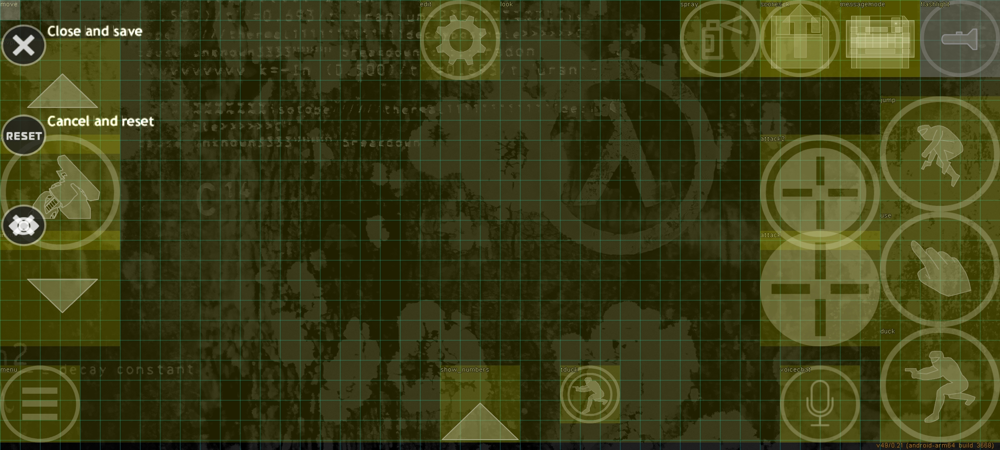
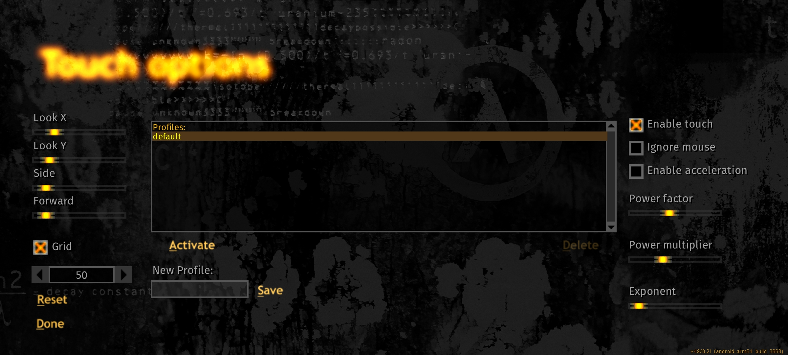
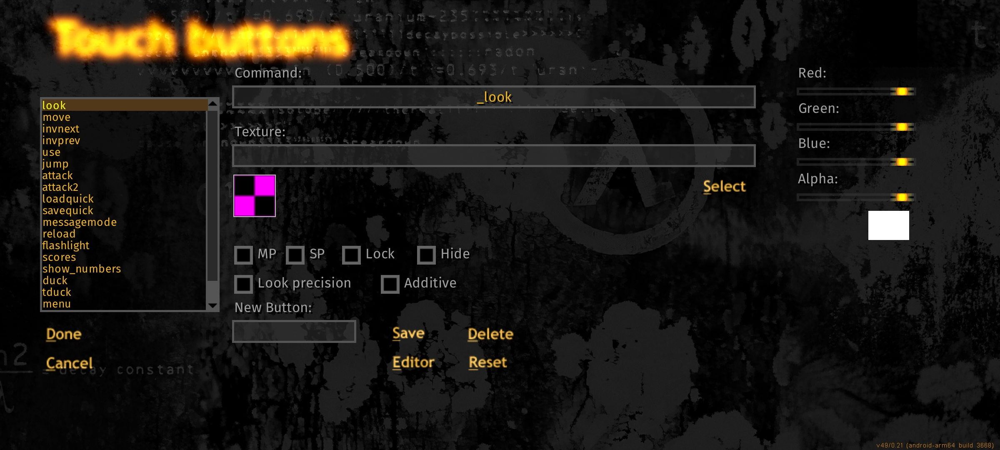
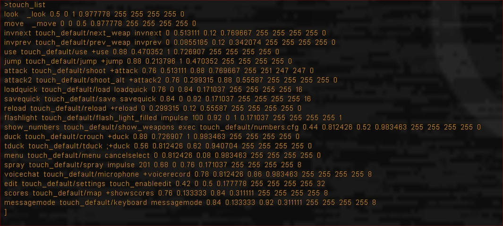
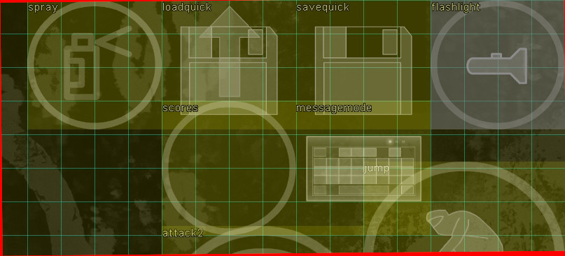
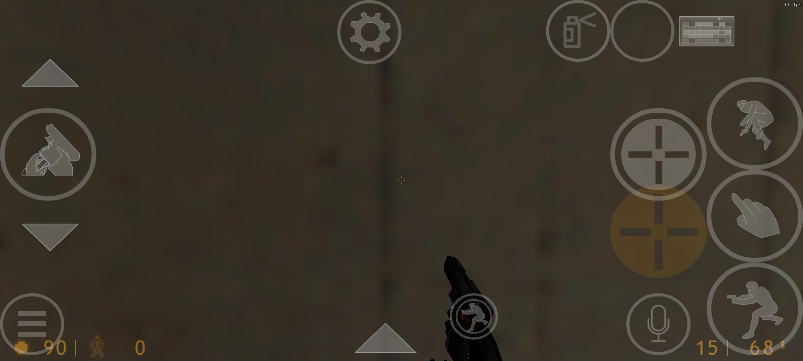
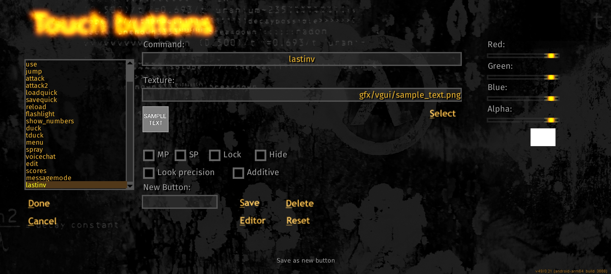
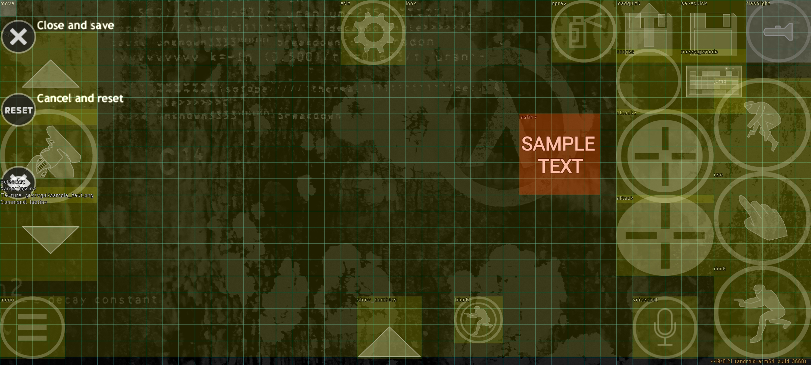
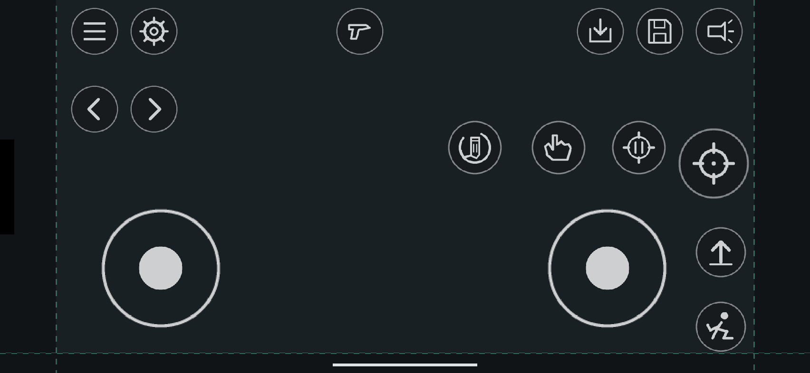
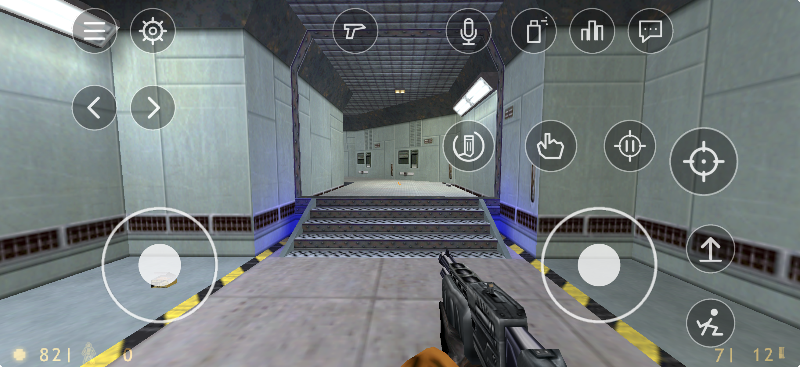

# Touch controls configuring

## Introduction

Thanks to mittorn, we have the ability to fully customize the controls in Xash3D. The new config allows you to not only add and change control buttons, but also create custom menus. There is also a built-in visual editor available, which simplifies the customization process without the need for manual file editing.

## Editor mode usage

1. Launch Xash3D and start the game.
2. To enter the edit mode, click on the gear icon (command `touch_enableedit`).
3. In the edit mode, the grid is displayed. The number of cells can be changed with the command `touch_grid_count` (default is 50). The grid can be disabled with the command `touch_grid_enable 0`.

*Touch controls layout editor*


*Touch profiles window*


*Touch buttons parameters window*


## Layout editor features

* **Moving buttons**: click on a button, drag it to the desired location, and release.
* **Resizing buttons**: place your first finger on the top left corner of the button, and use your second finger to resize it.
* **Hiding/showing buttons**: select the button (it will turn red), then use the menu:
    * **Close**: closes the editing mode (`touch_disableedit`).
    * **Reset**: resets the button to its default values.
    * **Hide/Show**: hides or shows the button (`touch_hide <name>` / `touch_show <name>`).

## Working with configuration files / console

All changes made in the visual editor are automatically saved to the touch profile file. The files are located in the `touch_profiles` folder inside game directory. The file name depends on the selected profile.

### Common commands in configuration files

```
// Comment: lines starting with // are ignored.

// Swipe zones for movement. Specify how far you need to swipe to speed up.
// The default values ​​are set to be optimal for a small swipe to immediately walk quickly.
touch_forwardzone "0.060000" ; touch_sidezone "0.060000"

// Sensitivity settings (pitch - horizontal, yaw - vertical).
touch_pitch ; touch_yaw

// Grid settings (see above).
touch_grid_count ; touch_grid_enable

// Draws a border around the button.
touch_set_stroke <thickness> <c> <v> <e> <t>
(<r> - red; <g> - green; <b> - blue; <a> - alpha/transparency)

// Show (1) or hide (0) client buttons.
touch_setclientonly

// Removes all buttons from the screen.
touch_removeall

// Shows all available buttons in the configuration file.
touch_list

// Saves the config after editing. You can specify a new file name.
touch_config_file command.cfg
```

*The full list of buttons in the standard `touch.cfg` file, displayed in the console when using `touch_list`.*



## Adding new buttons

To add a new button, use the console command:

```
touch_addbutton "digits" "touch/key_1.png" "toggle_digits" 0.340000 0.782222 0.400000 0.888889 255 255 255 100 0
```

### Parameters of `touch_addbutton` command

| Parameter | Description |
| --- | --- |
| `"digits"` | Unique name of the button. |
| `"touch/key_1.png"` | Path to the icon file (`.png` format). If the icon is not needed, leave `""`. |
| `"toggle_digits"` | Command to execute after clicking (for example, `"buy"` for purchase). |
| `0.340000` | X coordinate of the upper-left corner of the button. |
| `0.782222` | Y coordinate of the upper-left corner of the button. |
| `0.400000` | X coordinate of the lower-right corner of the button. |
| `0.888889` | Y coordinate of the lower-right corner of the button. |
| `255 255 255` | Button color in RGB format. |
| `100` | Button transparency (0 - fully transparent, 255 - fully opaque). |
| `0` | Flags (see next section). |

## List of flags

Flags define the behavior of the button. Their values ​​are powers of two:

| Flag | Value | Description |
| --- | --- | --- |
| `TOUCH_FL_HIDE` | 1 | Hides the button (not displayed in the game, but visible in the editor). |
| `TOUCH_FL_NOEDIT` | 2 | Disables editing of the button in the editor. |
| `TOUCH_FL_CLIENT` | 4 | The button is client-side (not saved in the main control file). |
| `TOUCH_FL_MP` | 8 | The button is displayed only in multiplayer. |
| `TOUCH_FL_SP` | 16 | The button is displayed only in singleplayer. |
| `TOUCH_FL_DEF_SHOW` | 32 | The button is always displayed on startup. |
| `TOUCH_FL_DEF_HIDE` | 64 | The button is always hidden on startup. |
| `TOUCH_FL_DRAW_ADDITIVE` | 128 | The button colors are added together in blend mode. |
| `TOUCH_FL_STROKE` | 256 | Enables outline stroke around the button. |

Flags can be combined by adding their values ​​together. For example, `5 = 1 + 4` is the combination of `TOUCH_FL_HIDE` and `TOUCH_FL_CLIENT` flags, which is a hidden client button.

*In the image below, the `spray`, `scores`, `messagemode` buttons are displayed simultaneously with the flag 8 and `loadquick`, `savequick` with the flag 16, and each is displayed in the corresponding game mode.*


## Useful commands

* `touch_hide <pattern>`: hides buttons by pattern.
* `touch_setcommand`: changes the command bound to a button.
* `touch_settexture`: quickly changes the button image.
* `touch_setcolor`: sets the button color.
* `touch_exportconfig`: exports the current configuration, including aspect ratio.

## Usage examples

* `touch_hide menu*` hides all buttons with names starting with `menu`.
* `touch_setcolor "attack" 255 160 0 128` changes the color of the primary fire button from opaque white to translucent orange, similar to the color of the HUD in Half-Life.

    *Result of executing this command*
    

* Example of adding a new button with a custom icon (the `lastinv` command is used - quick change between weapons)
    

    *View of this button in layout editor*
    

## Tips

* To prevent the `look` and `move` buttons from interfering with editing other elements, place them before the others in the configuration file.
* And vice versa, to make a button appear on top of others, place it at the end of the configuration file.
* You can assign commands to buttons that change other buttons, see the previous section "Usage examples".
* After editing each parameter of each individual button in the Touch Buttons section, do not forget to press Save, otherwise the applied parameters will not be saved.
* To create your own icon for the button, you can use any graphics editor (for Android, Photo Editor by iudesk is suitable). Saving conditions:
    * Image format - `.png` with transparency (e.g. alpha channel)
    * Aspect ratio / size - 1:1 / 256x256
    * Path to the icons location - `touch/gfx` inside game directory.
    
### Additional links
* [Handy palette for selecting color in RGB format](https://www.rapidtables.com/web/color/RGB_Color.html)

## iOS layout and safe areas

The main game menu also lays out within the current UIKit safe area. Images,
text, checkboxes, scroll clipping, model previews, and text input rectangles
share the same offset, and menu taps use the inverse offset. This keeps menu
items clear of the notch and home indicator in either landscape orientation.

On iOS, touch controls and their editor use the SDL window's current UIKit safe
area. This keeps buttons away from the notch, rounded screen edges and home
indicator, including after rotating the phone. Rendering and touch hit detection
use the same rectangle; menu and game-provided touch events retain screen
coordinates. Profile coordinates remain normalized between 0 and 1.

The iOS defaults include two visible analog sticks: movement on the lower left
and look on the lower right. Each has a hollow outer ring and a solid thumb disc
that follows your drag, stays inside the ring and returns to the centre when
released. Movement speed increases with displacement. Holding the look stick
away from the initial thumb position turns the camera continuously, using real
elapsed time like a controller stick. Picking it up is neutral even if the thumb
misses the ring centre. The sticks have a radial dead zone and clamp diagonal
input to the circle; look uses a radial response curve for fine aiming.
The look stick respects the menu's **Invert mouse** setting (`m_pitch` sign),
as well as `touch_pitch`, `touch_yaw`, precision and the client's aim/zoom
sensitivity. Its rate is added after mouse/swipe filtering so releasing it stops
turning immediately. Legacy `_look` swipe handling is unchanged.

Fire and alternate fire sit together above the right stick, with reload and use
to their left; jump and crouch
sit beside it. Weapon cycling sits above the movement stick. Menu, edit, weapon
selection and other utility actions sit along the top. Primary fire is larger
than secondary actions. Sticks use a 112-144 point diameter; other default
buttons have targets of at least 44 UIKit points when the window is available.
The circular action icons use white pictograms and dark translucent backgrounds.

`touch_stick_deadzone` sets the neutral radius as a fraction of the stick radius
(default `0.12`). `touch_lookjoy_speed` sets the base full-deflection look rate
before client aim sensitivity (default `60`); with `touch_yaw 120`,
`touch_pitch 90` and Half-Life's default `sensitivity 3`, this yields 180 degrees
per second horizontally and 135 vertically. `touch_lookjoy_curve` sets the radial
response exponent (default `2`, range `1`–`3`); `1` is linear. These settings are
saved in the touch profile. Profiles saved before this tuning may contain the
old base rate `180`; reduce it to `60`, or lower for high aim sensitivity.
The single crouch button defaults to **Hold**. Open the gear/layout editor and
tap **Crouch: Hold** or **Crouch: Toggle** to switch modes, then close and save.
The console equivalent is `touch_crouch_toggle 0` (hold) or
`touch_crouch_toggle 1` (toggle). Changing modes releases any active crouch.
The preference is saved in the profile. Custom crouch buttons can bind `_crouch`;
legacy `+duck` bindings retain their existing hold behavior.

Custom profiles can bind `_movejoy` and `_lookjoy` to circular stick regions;
the existing `_move`, `_joy` and `_look` controls remain available.



In-game controls on an iPhone:



Existing saved profiles are kept. To try the new arrangement, back up your
current profile using `touch_exportconfig touch_profiles/backup.cfg`, then run
`touch_removeall` followed by `touch_loaddefaults`. Adjust controls in the editor
and run `touch_writeconfig` to save them. The new icons ship in `ios-controls.pk3`
alongside `extras.pk3` in iOS builds; both archives must be installed.

The icon sources are generated with `python3 scripts/ios/generate_touch_icons.py`.
The generator uses only Python's standard library; no global packages are needed.

The regression checks use an existing C compiler and Python's standard library:

```
python3 scripts/ios/test_touch_sticks.py
python3 scripts/ios/test_menu_viewport.py
```

They compile the actual engine functions in small harnesses to check input
timing, inversion, filtering, release behavior, crouch modes, viewport bounds
and menu tap alignment. Device builds are still needed to verify UIKit insets
and assess the controls by touch.
