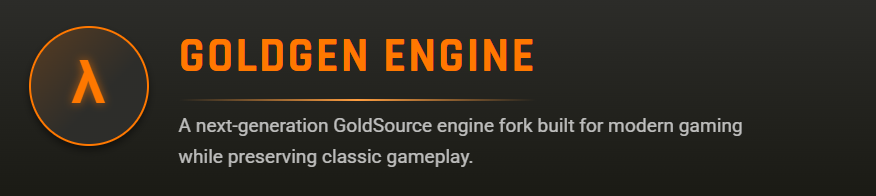

# Goldgen Engine 🚀

[](https://opensource.org/licenses/MIT)
[](https://github.com/Ibra66f/Goldgen/releases)



## Table of Contents
- [Introduction](#introduction)
- [Project Overview](#project-overview)
- [Key Features](#key-features)
- [Supported Operating Systems](#supported-operating-systems)
- [Modern Rendering APIs](#modern-rendering-apis)
- [Contribution Guidelines](#contribution-guidelines)
- [Documentation & Build Instructions](#documentation--build-instructions)
- [Changelog](#changelog)
- [License](#license)

## Introduction

**Goldgen Engine** is a next-generation fork of the Xash3D FWGS engine, designed to modernize and enhance the classic GoldSource game engine. Building on a robust foundation, Goldgen aims to improve performance, add modern rendering capabilities, and maintain backward compatibility with legacy games.

## Project Overview

- **Title of Work:** Goldgen Engine  
- **Creator:** [Bogussa Ibrahim](https://github.com/Ibra66f)  
- **GitHub Repository:** [Goldgen](https://github.com/Ibra66f/Goldgen)  
- **Year of Creation:** 2025

> **Goldgen** is a fork of the Xash3D FWGS engine, reimagined with modern enhancements while preserving compatibility with classic GoldSource titles. If you find this project useful, please credit the author and the engine in your work.

For additional context, check out:
- [GoldSrc on Valve Developer Community](https://developer.valvesoftware.com/wiki/GoldSrc)
- [Xash3D FWGS on GitHub](https://github.com/FWGS/xash3d-fwgs)

## Key Features

### GoldSource Engine Enhancement Prototype 🎮

- **Modern Enhancements:**
  - New features and performance optimizations.
  - Future support for advanced rendering techniques like Vulkan.

- **High-Resolution Support:**
  - Fixed-size buffers (`row[4096 * 3]`, `rgba[4096 * 4]`) for up to 4096-pixel widths.
  - Maintains 32-bit dimensions using `int`.

- **Truecolor Output:**
  - **BMP:** Converts 8-bit indexed textures to 24-bit BGR.
  - **TGA:** Outputs 32-bit RGBA (with an alpha channel set to 255 for full opacity).

- **Backward Compatibility:**
  - Retains palette-based source data handling, ensuring compatibility with legacy .MDL files.
  - Default `.tga` output with an option to modify for BMP use.

- **Performance & Safety:**
  - Utilizes stack-allocated buffers for speed; dynamic allocation for textures over 4K.
  - Uses secure file operations (`Q_snprintf`, `Q_strncpy`) to ensure path safety.

### MenuStrings.cpp Update

- **Memory Safety:**  
  Implements RAII with `LocalizedString` and smart pointers for file buffers.

- **Encoding Support:**  
  Modular encoding detection with UTF-16LE to UTF-8 conversion and CP1251 integration.

- **Performance:**  
  Employs an LRU caching strategy, bulk parsing via a state machine, and direct memory mapping.

- **Error Handling & Compatibility:**  
  Detects missing strings, falls back to English if needed, and preserves original string IDs and file formats.

#### Example: Reloading Localization

```cpp
// Reload localization via console command
void ReloadLocalization() {
    UI_ShutdownLocalization(); // Clean up current localization resources
    UI_InitLocalization();     // Reinitialize localization with updated settings
}
```

## Supported Operating Systems

Goldgen Engine currently supports:
- **Windows**
- **Linux**
- Additional platforms may be supported through community contributions.

## Modern Rendering APIs

Goldgen is exploring support for modern rendering APIs to boost performance and visual quality:
- **Vulkan:** Early file structure and support in development.


Community input and contributions are welcomed to drive these enhancements.

## Contribution Guidelines

We encourage community contributions. Here’s how you can help:
- **Submit Pull Requests:** Add features, improve performance, or fix bugs.
- **Report Issues:** Use the GitHub Issues section to report bugs or request enhancements.
- **Discuss Ideas:** Join the GitHub Discussions to share feedback and brainstorm new features.

For detailed contribution guidelines, please refer to the [CONTRIBUTING.md](https://github.com/Ibra66f/Goldgen/blob/main/CONTRIBUTING.md) file in the repository.

## Documentation & Build Instructions

- **Documentation:**  
  Build instructions and additional documentation are being developed and will soon be available in the `/Docs` directory.

Stay updated as the project evolves!

## Changelog

### 10 March 2025
- Added initial Vulkan file structure for early VK support.

### 08 March 2025
- **4K Resolution Support:** Updated fixed-size buffers and truecolor output.
- **Backward Compatibility:** Ensured legacy formats remain supported.
- **Performance Enhancements:** Implemented stack-allocated buffers for improved speed.
- **MenuStrings.cpp Enhancements:** Added memory safety improvements, encoding support, and diagnostic logging.

## License

This project is licensed under the [MIT License](LICENSE).

---

Thank you for your interest in Goldgen Engine!  
Created by **Bogussa Ibrahim (2025)

For more details, visit the [GitHub Repository](https://github.com/Ibra66f/Goldgen).


---
